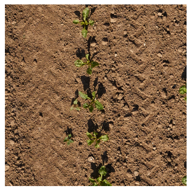
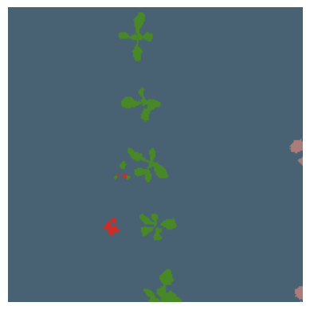

# Crop and Weed Semantic Segmentation

This project focuses on the semantic segmentation of crops and weeds using FastAI and the RESNET 18 model fine-tuned with UNET Learner. The dataset used is provided by PhenoBench.

## Overview

Crop and Weed Semantic Segmentation is a demo application that showcases the capability to perform precise semantic segmentation of agricultural images. It offers the following features:

- Segmentation of soil, crops, weeds, and partial crop/weed regions with distinct colour codes (blue, green, red, and light red, respectively).
- An example image and its segmented counterpart for reference.
- Real-time segmentation using your device's camera.

## Data Preprocessing

The dataset was preprocessed by converting it to float tensors and normalizing it using Imagenette stats to facilitate model training.

## Kaggle Model Building Code

The Kaggle notebook [semantic-segmentation-v2](https://www.kaggle.com/code/carterrishi/semantic-segmentation-v2) contains the code used for building and fine-tuning the semantic segmentation model.

## Streamlit App

The Streamlit application code, example image, and a pre-trained model for testing are available in the [App Link](https://semanticsegmentation.streamlit.app/).

## Example



*Figure 1: Original Image*



*Figure 2: Segmented Image*

## Dataset

The dataset is available through PhenoBench and is essential for training and evaluation. PhenoBench is a large dataset for the semantic interpretation of images of real agricultural fields.

## Dependencies

- Python 3.7+
- FastAI
- Streamlit

## Performance Evaluation

While this project serves as a demonstration of semantic segmentation capabilities, no formal performance evaluation or comparison with other models has been conducted.

## Acknowledgements

- PhenoBench for providing the dataset.

```
@article{weyler2023dataset,
  author = {Jan Weyler and Federico Magistri and Elias Marks and Yue Linn Chong and Matteo Sodano 
    and Gianmarco Roggiolani and Nived Chebrolu and Cyrill Stachniss and Jens Behley},
  title = {{PhenoBench --- A Large Dataset and Benchmarks for Semantic Image Interpretation
    in the Agricultural Domain}},
  journal = {arXiv preprint},
  year = {2023}
}
```

- FastAI community for their invaluable contributions.

```
https://github.com/fastai/fastai
```
